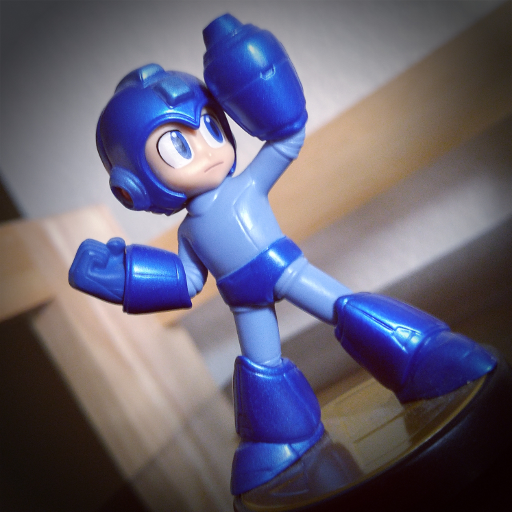

# ANSI-Color-Freak
Converts .BMP image to ANSI (8/16 color) version.

ANSI Color Freak is still a work in progress, and to be honest, I'm not entirely sure what the goal of this project is, but here's a brief description of what it currently does.

The program will accept a command line argument that is the name of a .BMP format file. It prefers 24bit (R8 G8 B8) images. The input image is then scanned and each pixel gets replaces with one of 16 colors from the ANSI 8/16 color set. This is done by obtaining the HSV color data of each pixel, and using that information to best select an appropriate color from the fixed palette. It's not a perfect implementation, but it does a better job than typical averaging.

The program currently opens a small sample view window but functionality for this feature has not been completed yet. There's clearly more work to be done...

## TO-DO:
* Either remove sample display window, or scale sample to fit.
* For images with 80 pixel width or less, generate an ANSI escape code version that can be viewed in terminal.
* Provide a makefile.
* Consider making dither feature an option (command line argument).

## UPDATED:
* *2016.02.11*- Added simple dither class and employed on grayscale and color ranges. Works well for colorful images. Not so much for images with reduced palettes to begin with. See sample image update.

## SAMPLE
*Note:* The .BMP image used as source input and the resulting output image have been converted to .PNG for the purposes of this README.

Please note that this program requires [SDL](http://libsdl.org) framework to compile.
